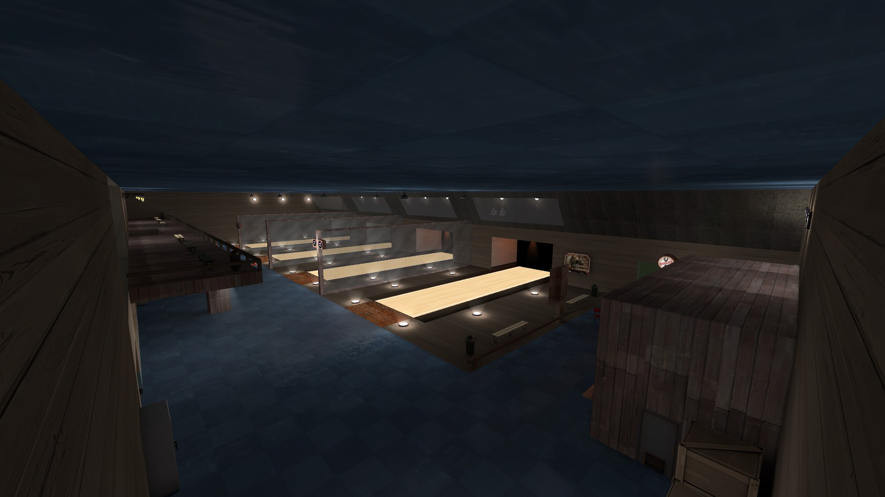
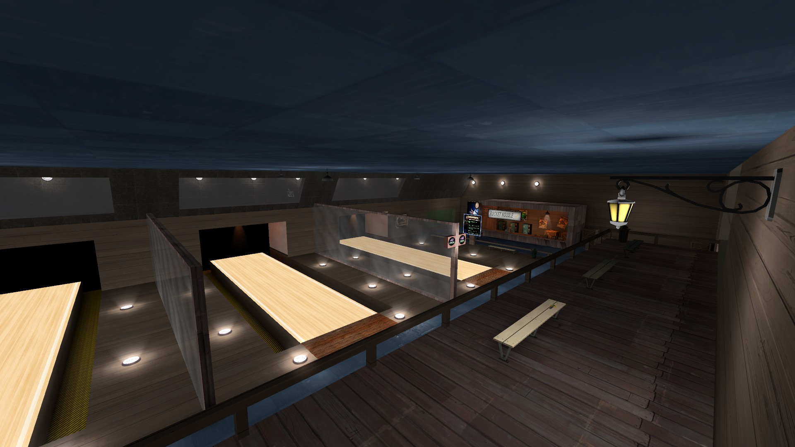
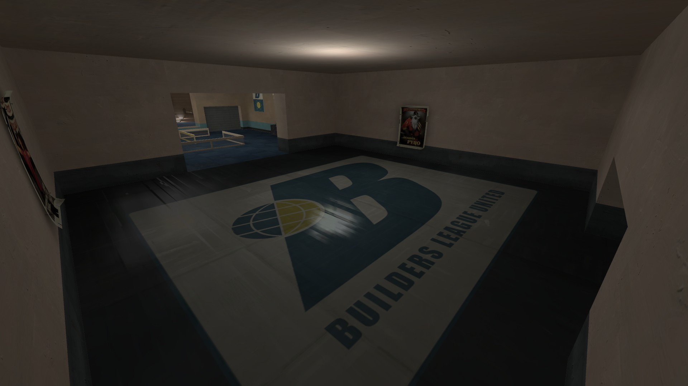
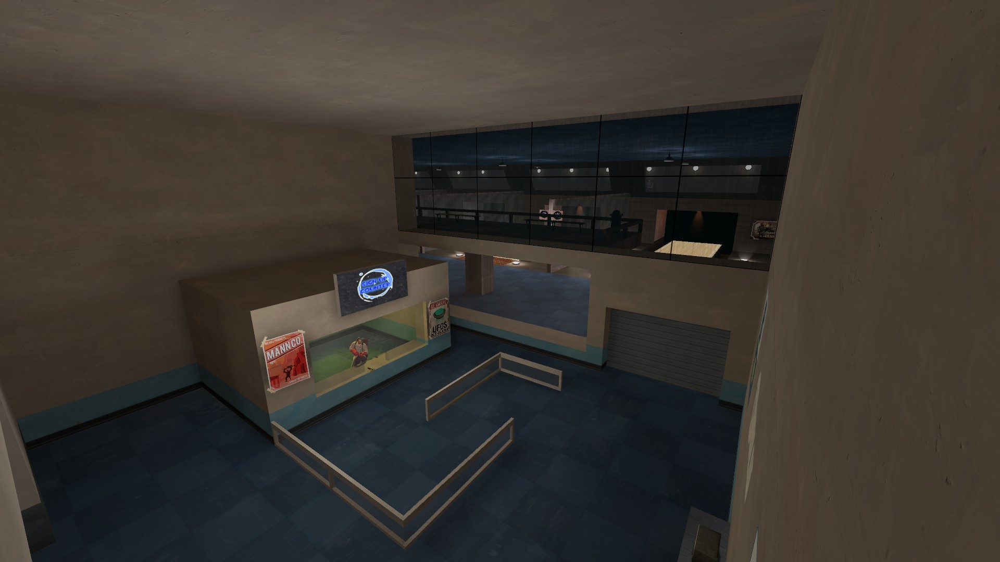
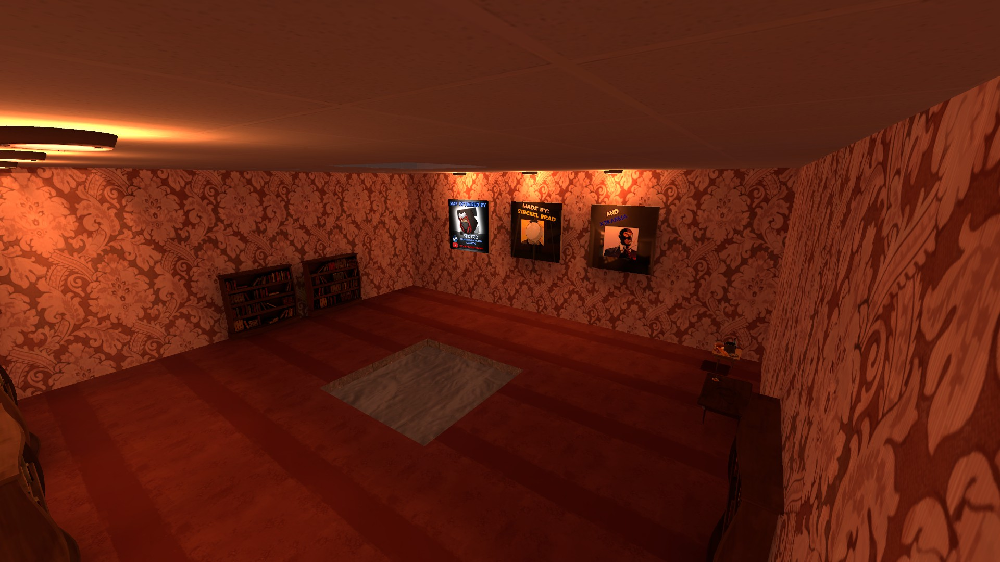

#### Originally made for Titan.TF
- [Release Trailer](https://www.youtube.com/watch?v=kXK2yqUzSo4) (map shown is an older version of bowl_alley)

### Credits
- Developed by myst
- Map rc1 by Sretzo
- Older map versions by Brad

### Screenshots






### Requirements
---
- **[TF2 Items Give Weapon](https://forums.alliedmods.net/showthread.php?p=1337899?p=1337899)** for giving weapons
- **[SteamTools](https://builds.limetech.io/?p=steamtools)** (Optional) to set game description

### Commands and ConVars
---

### Public Commands
| Command                                     | Description                               | Parameters                             |
|---------------------------------------------|-------------------------------------------|----------------------------------------|
| `sm_bhelp`                                  | Get information for the bowling gamemode. | -                                      |
| `sm_join`, `sm_lane`, `sm_lanes`, `sm_bowl` | Opens the lane selection menu.            | `<lane_number>` to join a lane |
| `sm_r`, `sm_ready`                          | Ready up while in a lane.                 | -                                      |
| `sm_leave`                                  | Leave a lane.                             | -                                      |

### Admin Commands
| Command       | Description                                                                                                                    | Parameters |
|---------------|--------------------------------------------------------------------------------------------------------------------------------|------------|
| `sm_teleport` | Used to teleport a player to where you are pointing at. Use this to setup your pins.                                           | -          |
| `sm_getpos`   | Used to print the coordinates of all pins from either lanne 1 or 2. Use this after setting up the positions using sm_teleport. | -          |

### ConVars
| ConVar               | Description                                                                             | Default Value | Minimum Value | Maximum Value |
|----------------------|-----------------------------------------------------------------------------------------|---------------|---------------|---------------|
| `bowling_maxplayers` | Sets the maximum players per lane.                                                      | 6             | 1             | 1             |
| `bowling_wfp_time`   | Sets the maximum waiting for players time.                                              | 120           | 10            | 600           |
| `bowling_roll_time`  | Sets the maximum time allowed for players to roll their ball. Prevents a troll delaying | 10            | 50            | 60            |

### Map Configuration
---
Use the built in commands sm_teleport and sm_getpos to help you get the coordinates.

```
"Bowling"
{
	"bowl_alley_rc1" // this is the map name
	{
		//
		//  ========================================================================================================================
		//		Player Positions
		//  ========================================================================================================================
		//
		
		"Players"
		{
			// the xyz positions to teleport to when it is the player's turn to play
			// lane 1
			"lane1_playingpos_x"			"65.201431"
			"lane1_playingpos_y"			"1791.190551"
			"lane1_playingpos_z"			"2.031250"
			
			// the xyz positions to teleport to when it is the player's turn to play
			// lane 2
			"lane2_playingpos_x"			"-633.743835"
			"lane2_playingpos_y"			"1792.109252"
			"lane2_playingpos_z"			"2.031250"
			
			// the xyz positions to teleport to when the player has just finished his turn
			// lane 1
			"lane1_exitpos_x"				"66.068328"
			"lane1_exitpos_y"				"1612.255249"
			"lane1_exitpos_z"				"0.031250"
			
			// the xyz positions to teleport to when the player has just finished his turn
			// lane 2
			"lane2_exitpos_x"				"-638.619934"
			"lane2_exitpos_y"				"1612.123901"
			"lane2_exitpos_z"				"0.031250"
		}
		
		//
		//  ========================================================================================================================
		//		Pin Positions
		//  ========================================================================================================================
		//
		
		"Pins"
		{
			// the xyz angles positions that pins will look at
			// lane 1
			"lane1_anglepos_x"			"-0.346446"
			"lane1_anglepos_y"			"-89.998428"
			"lane1_anglepos_z"			"0.000000"
			
			// the xyz angles positions that pins will look at
			// lane 2
			"lane2_anglepos_x"			"-0.230963"
			"lane2_anglepos_y"			"-89.882896"
			"lane2_anglepos_z"			"0.000000"
			
			// the xyz positions to spawn pins at
			// lane 1
			"lane1_pin1pos_x"			"72.639099"
			"lane1_pin1pos_y"			"2687.895263"
			"lane1_pin1pos_z"			"0.031250"
			
			"lane1_pin2pos_x"			"95.112854"
			"lane1_pin2pos_y"			"2744.845458"
			"lane1_pin2pos_z"			"0.031250"
			
			"lane1_pin3pos_x"			"47.192626"
			"lane1_pin3pos_y"			"2744.845458"
			"lane1_pin3pos_z"			"0.031250"
			
			"lane1_pin4pos_x"			"119.276855"
			"lane1_pin4pos_y"			"2792.455078"
			"lane1_pin4pos_z"			"0.031250"
			
			"lane1_pin5pos_x"			"73.345581"
			"lane1_pin5pos_y"			"2792.455078"
			"lane1_pin5pos_z"			"0.031250"
			
			"lane1_pin6pos_x"			"28.412414"
			"lane1_pin6pos_y"			"2792.455078"
			"lane1_pin6pos_z"			"0.031250"
			
			"lane1_pin7pos_x"			"142.741516"
			"lane1_pin7pos_y"			"2846.986816"
			"lane1_pin7pos_z"			"0.031250"
			
			"lane1_pin8pos_x"			"91.407653"
			"lane1_pin8pos_y"			"2846.986816"
			"lane1_pin8pos_z"			"0.031250"
			
			"lane1_pin9pos_x"			"39.171752"
			"lane1_pin9pos_y"			"2846.986816"
			"lane1_pin9pos_z"			"0.031250"
			
			"lane1_pin10pos_x"			"-8.980102"
			"lane1_pin10pos_y"			"2846.986816"
			"lane1_pin10pos_z"			"0.031250"
			
			// the xyz positions to spawn pins at
			// lane 2
			"lane2_pin1pos_x"			"-646.124450"
			"lane2_pin1pos_y"			"2687.895263"
			"lane2_pin1pos_z"			"0.031250"
			
			"lane2_pin2pos_x"			"-610.471008"
			"lane2_pin2pos_y"			"2744.845458"
			"lane2_pin2pos_z"			"0.031250"
			
			"lane2_pin3pos_x"			"-665.804260"
			"lane2_pin3pos_y"			"2744.845458"
			"lane2_pin3pos_z"			"0.031250"
			
			"lane2_pin4pos_x"			"-601.630004"
			"lane2_pin4pos_y"			"2792.455078"
			"lane2_pin4pos_z"			"0.031250"
			
			"lane2_pin5pos_x"			"-642.486938"
			"lane2_pin5pos_y"			"2792.455078"
			"lane2_pin5pos_z"			"0.031250"
			
			"lane2_pin6pos_x"			"-684.339782"
			"lane2_pin6pos_y"			"2792.455078"
			"lane2_pin6pos_z"			"0.031250"
			
			"lane2_pin7pos_x"			"-572.653350"
			"lane2_pin7pos_y"			"2846.986816"
			"lane2_pin7pos_z"			"0.031250"
			
			"lane2_pin8pos_x"			"-618.972167"
			"lane2_pin8pos_y"			"2846.986816"
			"lane2_pin8pos_z"			"0.031250"
			
			"lane2_pin9pos_x"			"-663.770446"
			"lane2_pin9pos_y"			"2846.986816"
			"lane2_pin9pos_z"			"0.031250"
			
			"lane2_pin10pos_x"			"-711.663635"
			"lane2_pin10pos_y"			"2846.986816"
			"lane2_pin10pos_z"			"0.031250"
		}
	}
}
```
